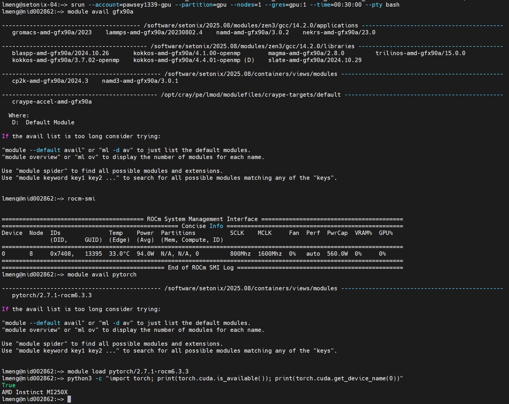

# Pawsey Setonix

[Pawsey](https://pawsey.org.au) is Australia's national supercomputing centre. [Setonix](https://pawsey.org.au/systems/setonix/) is their flagship supercomputer with **AMD Instinct MI250X GPUs** (ROCm).

**Project:** `pawsey1339` — expires 2026-06-30
**Support:** help@pawsey.org.au

!!! warning
    Setonix GPUs are **AMD MI250X — ROCm only**. CUDA code (e.g. Isaac Sim) will **not** run. For CUDA workloads use [NCI Gadi](nci.md) or [M3](m3.md) instead.

---

## Members

**Project:** `pawsey1339` | 11 members | *Last updated: 2026-05-01*

| Name | Username | Role |
|---|---|---|
| **Dana Kulić** | `dkulic` | PI |
| **Lingheng Meng** | `lmeng` | Admin — project manager |
| Somayeh Hussaini | `somayehh` | Admin |
| Kavi Katuwandeniya | `kkatu` | Admin |
| Jesse Kipchumba | `jkipchumba` | Member |
| Jack Moses | `jmoses` | Member |
| Vedansh Malhan | `vmalhan` | Member |
| William Ngo | `wngo` | Member |
| Jordan Rozario | `jrozario` | Member |
| Suhaas Kataria | `skataria` | Member |
| Juyan Zhang | `jzhang7` | Member |

---

## Getting Access

Contact Lingheng (`lingheng.meng1@monash.edu`) to be invited. You'll receive an email from Pawsey — click the link to create your account and set a password.

---

## Connecting

```bash
ssh {your_pawsey_id}@setonix.pawsey.org.au
```

You land on a login node — use it for editing scripts, submitting jobs, and checking status. Do not run heavy computation on login nodes.

**Your home directory shows hidden files by default** — run `ls -a` to see them all.

Your scratch directory (`$MYSCRATCH`) is not automatically linked in your home. Create a symlink for convenience:

```bash
ln -s $MYSCRATCH ~/scratch
```

---

## Storage

| Path | Env var | Quota | Purge | Use for |
|------|---------|-------|-------|---------|
| `/home/{username}` | `$HOME` | 1 GiB | No | Shell config, dotfiles only |
| `/software/projects/pawsey1339/{username}` | `$MYSOFTWARE` | 256 GiB shared | No | Conda envs, installs, SLURM scripts |
| `/scratch/pawsey1339/{username}` | `$MYSCRATCH` | 1 PiB shared | **21 days (last access)** | Job input/output, working data |
| `/acacia` (project) | — | 512 GB shared | No | Long-term archival, results |
| `/acacia` (personal) | — | 100 GB | No | Personal long-term storage |

```bash
cd $MYSCRATCH       # go to your working directory
echo $MYSOFTWARE    # your software/install dir
```

!!! warning
    `/scratch` is purged **21 days after last access** (not last modification — changed from 1 month since June 2024). Do not use `touch` to reset the timer — Pawsey explicitly prohibits this. Move important outputs to `/acacia` promptly.

!!! tip
    Use `munlink` instead of `rm` to delete scratch files — it reduces filesystem scan load for other users:
    ```bash
    munlink myfile.dat
    munlink -r mydirectory/
    ```

!!! tip
    `/software` quota is **shared across the whole project**. Keep conda environments lean and remove unused ones. See [Managing File Count Limits](file-count.md) for strategies: containers, shared environments, zip+RAM extraction, and more.

### Shared datasets

All project members share a common directory — use it to avoid duplicating large datasets:

```bash
# Persistent shared space (no purge)
/software/projects/pawsey1339/shared/datasets/

# High-performance shared space (21-day purge)
/scratch/pawsey1339/shared/
```

---

## Transferring Files

Use the **data mover node** for large transfers:

```bash
# Upload (run on your local machine)
scp myfile.py {username}@data-mover.pawsey.org.au:$MYSCRATCH/

# Download (run on your local machine)
scp {username}@data-mover.pawsey.org.au:$MYSCRATCH/output.log .
```

---

## Software Modules

```bash
module avail            # list all available software
module avail python     # search for a specific package
module load python/3.11 # load a module
module list             # show currently loaded modules
```

---

## Submitting Jobs (SLURM)

!!! warning "CPU and GPU use different SLURM accounts"
    CPU jobs: `--account=pawsey1339`
    GPU jobs: `--account=pawsey1339-gpu`
    Using the wrong account gives "Invalid account or account/partition combination" error.

| Partition | Account | Use | Max walltime |
|-----------|---------|-----|-------------|
| `work` | `pawsey1339` | Standard CPU | 24 hrs |
| `debug` | `pawsey1339` | Quick CPU tests | 1 hr |
| `long` | `pawsey1339` | Long CPU jobs | 96 hrs |
| `highmem` | `pawsey1339` | High-memory CPU | 96 hrs |
| `gpu` | `pawsey1339-gpu` | AMD MI250X GPU (ROCm) | 24 hrs |
| `gpu-dev` | `pawsey1339-gpu` | GPU testing/interactive | 4 hrs |
| `gpu-highmem` | `pawsey1339-gpu` | High-memory GPU | 48 hrs |

### CPU job

```bash
#!/bin/bash
#SBATCH --job-name=my_job
#SBATCH --account=pawsey1339
#SBATCH --partition=work
#SBATCH --ntasks=1
#SBATCH --cpus-per-task=8
#SBATCH --mem=32G
#SBATCH --time=04:00:00
#SBATCH --output=%x-%j.out

module load python/3.11
cd $MYSCRATCH
python train.py
```

### GPU job (AMD ROCm)

```bash
#!/bin/bash
#SBATCH --job-name=gpu_job
#SBATCH --account=pawsey1339-gpu
#SBATCH --partition=gpu
#SBATCH --nodes=1
#SBATCH --gres=gpu:1
#SBATCH --time=04:00:00
#SBATCH --output=%x-%j.out

module load rocm
cd $MYSCRATCH
python train.py
```

!!! warning "Do not set `--cpus-per-task` or `--mem` for GPU jobs"
    Setonix auto-assigns both (8 CPUs + 29,440 MB RAM per GPU). Specifying them explicitly causes a `cli_filter` error and the job is rejected.

!!! tip "NVMe local storage"
    GPU nodes have 3,575 GB NVMe per node accessible at `/tmp` and `/var/tmp`. Default allocation is 128 GiB per job. To request more, add `tmp:<value>G` to `--gres`:
    ```
    #SBATCH --gres=gpu:1,tmp:512G
    ```
    **Important:** migrate any results from `/tmp` before the job completes — NVMe is wiped after the job finishes.

### Loading PyTorch / ML frameworks

```bash
module avail pytorch           # find pytorch module
module load pytorch/2.7.1-rocm6.3.3   # as of 2026-05-20

# Verify the GPU is visible
python3 -c "import torch; print(torch.cuda.is_available()); print(torch.cuda.get_device_name(0))"
# Expected output: True / AMD Instinct MI250X
```

Other GPU-enabled modules use the `amd-gfx90a` suffix (GROMACS, LAMMPS, NAMD, etc.):

```bash
module avail gfx90a
```

For ROCm directly (e.g. when using your own PyTorch install):

```bash
module avail rocm     # as of 2026-05-20: rocm/6.3.3
module load rocm
```

### Interactive GPU session

Use `gpu-dev` for testing — shorter queue, 4h max:

```bash
srun --account=pawsey1339-gpu --partition=gpu-dev --nodes=1 --gres=gpu:1 --time=00:30:00 --pty bash
```

Once on the node, verify the GPU:

```bash
rocm-smi
module load pytorch/2.7.1-rocm6.3.3
python3 -c "import torch; print(torch.cuda.is_available()); print(torch.cuda.get_device_name(0))"
# Expected: True / AMD Instinct MI250X
```



### Essential SLURM commands

```bash
sbatch job.sh        # submit a job
squeue --me          # check your jobs
scancel <jobid>      # cancel a job
seff <jobid>         # show job efficiency (CPU/memory usage)
```

---

## Checking Usage

```bash
# Storage and SU balance
pawseyAccountBalance -s

# Scratch quota
lfs quota -g $PAWSEY_PROJECT -h /scratch

# Home directory
/usr/bin/quota -s -f /home
```

SU usage is also visible in the [Origin portal](https://portal.pawsey.org.au/origin/) → project → compute resources.

!!! note
    SUs are allocated quarterly and do **not** carry over. Jobs can still run after the budget is exhausted but at lower priority.

**GPU SU rate:** Each MI250X GCD (= 1 SLURM GPU, 64 GB HBM) costs **64 SU/hour**. A full node (8 GCDs) costs 512 SU/hour. Our 500,000 GPU SU allocation is equivalent to ~7,800 single-GPU hours.

---

## Useful Links

- [Getting Started](https://pawsey.atlassian.net/wiki/spaces/US/pages/51925850/Getting+Started+with+Supercomputing)
- [Pawsey Filesystems](https://pawsey.atlassian.net/wiki/spaces/US/pages/51925876/Pawsey+Filesystems+and+their+Use)
- [Setonix GPU Partition Quick Start](https://pawsey.atlassian.net/wiki/spaces/US/pages/51928618/Setonix+GPU+Partition+Quick+Start) — account naming, NVMe, SU rates, supported apps
- [GPU Jobs on Setonix](https://pawsey.atlassian.net/wiki/spaces/US/pages/51929056)
- [Acacia Object Storage](https://pawsey.atlassian.net/wiki/spaces/US/pages/51924576/Pawsey+Object+Storage+Acacia)
- [System Status](https://status.pawsey.org.au)
